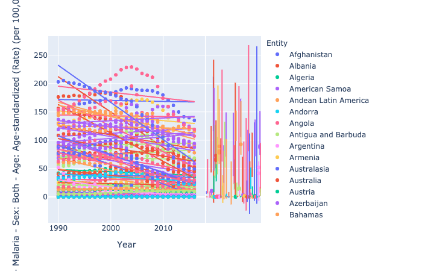
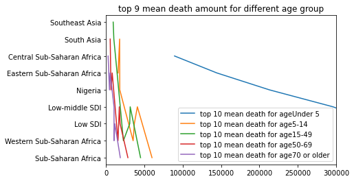
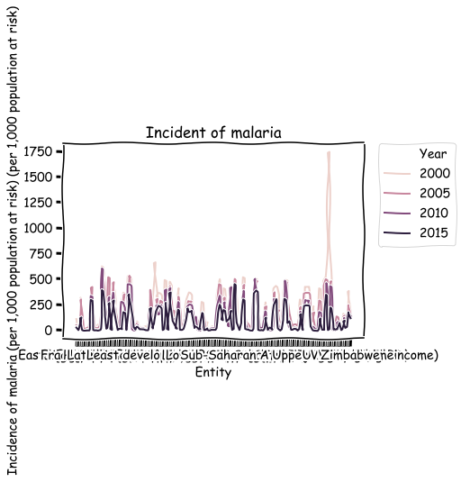

Title: Informative Visualizations about Malaria
Date: 2020-09-20 20:55
headline: Yiping's Blog3

Create  informative visualizations about malaria using Python 
Malaria is a serious and sometimes fatal disease caused by a parasite that commonly infects a certain type of mosquito which feeds on humans. Using python to visualize malaria distribution and malaria death


## Download Data

```python
url = 'https://raw.githubusercontent.com/rfordatascience/tidytuesday/master/data/2018/2018-11-13/malaria_deaths.csv'
pd1 = pd.read_csv(url)
```


```python
url = 'https://raw.githubusercontent.com/rfordatascience/tidytuesday/master/data/2018/2018-11-13/malaria_deaths_age.csv'
pd2 = pd.read_csv(url)
```


```python
url = 'https://raw.githubusercontent.com/rfordatascience/tidytuesday/master/data/2018/2018-11-13/malaria_inc.csv'
pd3 = pd.read_csv(url)
```


```python
pd.options.plotting.backend = 'plotly'
```
## First  visualization about malaria_death Data

```python

pd1.plot.scatter(
    x='Year', 
    y='Deaths - Malaria - Sex: Both - Age: Age-standardized (Rate) (per 100,000 people)', 
    color='Entity', 
    marginal_y="violin",
    trendline="ols"
)
```



## From this plot, we can see most of the country have the trend of  coming down for death rate from 1990 to 2015. (detailed plot shown in uploaded ipynb file in homework3.


## Deal with malaria_deaths_age dataset

```python
pd2["mean"] = np.nan
```


```python
pd.options.mode.chained_assignment = None  
```


```python
# add mean death for every contry from 1990 - 2016
for con in pd2['entity'].unique():
    for  age in pd2['age_group'].unique():
        x = np.mean(pd2.loc[(pd2['entity'] == con ) & (pd2['age_group'] == age) ]["deaths"])
        pd2["mean"].loc[(pd2['entity'] == con ) & (pd2['age_group'] == age)] = x
```


```python
pd22 = pd2.drop(columns=['year', 'code',"deaths","Unnamed: 0"])

```


```python
df2 = pd22.drop_duplicates(keep='first') 
df22 = df2.sort_values("mean",ascending = False)
```
## Second visualization about malaria_deaths_age dataset

```python
for age in df22['age_group'].unique():
           x = df22.loc[df22['age_group'] == age]
           x = x.sort_values('mean',ascending = False)[1:8]
           plt.xlim([0.0, 300000]) 
           plt.plot(x["mean"] ,x["entity"],label='top 10 mean death for age' + str (age))
           plt.title('top 9 mean death amount for different age group') 
           plt.legend(loc="lower right")             
```




## From this plot, we can see Sub-Saharan Afraica always have highest death from 1990 to 2016. And age Under5 have the greatest death amount.


```python
pd.options.plotting.backend = 'plotly'
```


```python
pd3.head()
```


<div>
<style scoped>
    .dataframe tbody tr th:only-of-type {
        vertical-align: middle;
    }

    .dataframe tbody tr th {
        vertical-align: top;
    }

    .dataframe thead th {
        text-align: right;
    }
</style>
<table border="1" class="dataframe">
  <thead>
    <tr style="text-align: right;">
      <th></th>
      <th>Entity</th>
      <th>Code</th>
      <th>Year</th>
      <th>Incidence of malaria (per 1,000 population at risk) (per 1,000 population at risk)</th>
    </tr>
  </thead>
  <tbody>
    <tr>
      <th>0</th>
      <td>Afghanistan</td>
      <td>AFG</td>
      <td>2000</td>
      <td>107.100000</td>
    </tr>
    <tr>
      <th>1</th>
      <td>Afghanistan</td>
      <td>AFG</td>
      <td>2005</td>
      <td>46.500000</td>
    </tr>
    <tr>
      <th>2</th>
      <td>Afghanistan</td>
      <td>AFG</td>
      <td>2010</td>
      <td>23.900000</td>
    </tr>
    <tr>
      <th>3</th>
      <td>Afghanistan</td>
      <td>AFG</td>
      <td>2015</td>
      <td>23.600000</td>
    </tr>
    <tr>
      <th>4</th>
      <td>Algeria</td>
      <td>DZA</td>
      <td>2000</td>
      <td>0.037746</td>
    </tr>
  </tbody>
</table>
</div>


## Third visualization about malaria_in dataset


```python
with plt.xkcd():
    g = sns.lineplot(data=pd3, x='Entity', y='Incidence of malaria (per 1,000 population at risk) (per 1,000 population at risk)', hue='Year')
    g.set_title('Incident of malaria')
    plt.legend(bbox_to_anchor=(1.05, 1), loc=2, borderaxespad=0.)
```





## From this plot, we can see the incidence of malaria decrease from 2000 to 2015. The line for 2000 is the highest and line for 2015 is the lowest


