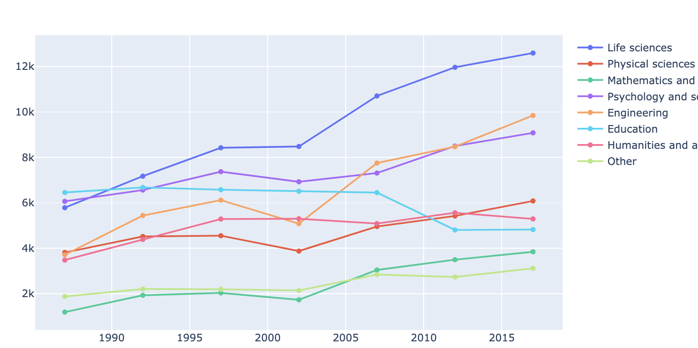

Title: Dashboard Visualization for Phd awards using dash
Date: 2020-11-05 20:55
headline:Yiping's Blog 6


### Download data of PhDs awarded in the US. Do some analysis in pandas. Make a dashboard visualization of a few interesting aspects of the data using dash.


## Interesting Aspects:  
1.Trend of total number of doctorate recipients in the United States from 1958 to 2007  

2.Trends of number of doctorates recipients in the United States in different major fields  from 1987 to 2007  

3.Trends in the number of doctorates recipients in the United States among gender from 1987 to 2007

### First Aspect

[plotly] /images/fig.json [/plotly]

### From this plot, we can see the total number of doctorate recipients in the United States from 1958 to 2007 is increasing which is a great trend.

### Second Aspect

```python
df21 = df2.iloc[:,1::2]
df21["Field of study"] = df2.iloc[:,0]
field = ['Life sciences', 'Physical sciences and earth sciences', 'Mathematics and computer sciences', 'Psychology and social sciences', 'Engineering', 'Education', 'Humanities and arts','Other']
df22 = df21[df21['Field of study'].isin(field)]
df22= df22.rename(columns={'Field of study': 'Year'})
df22 = df22.T
df22 = df22.reset_index()
df22.columns = ["Year",'Life sciences', 'Physical sciences and earth sciences', 'Mathematics and computer sciences', 'Psychology and social sciences', 'Engineering', 'Education', 'Humanities and arts','Other']
```

### This is the plot of combine all field together in one plot




```python
fig.update_layout(
    updatemenus=[
        dict(
            active=0,
            buttons=list([
                dict(
                    args=["visible", [True,False,False,False,False,False,False,False]],
                    label="Life sciences",
                ),
                dict(
                    args=["visible", [False,True,False, False,False,False,False,False]],
                    label="Physical sciences and earth sciences",
                ),
                dict(
                    args=["visible", [False,False,True, False,False,False,False,False]],
                    label="Mathematics and computer sciences",
                ),
                dict(
                    args=["visible", [ False,False, False,True,False,False,False,False]],
                    label="Psychology and social sciences",
                ),
                dict(
                    args=["visible", [ False,False,False,False,True,False,False,False]],
                    label="Engineering",
                ),
                dict(
                    args=["visible", [ False,False,False,False,False,True,False,False]],
                    label="Education",
                ),
                dict(
                    args=["visible", [False, False,False,False,False,False,True,False]],
                    label="Humanities and arts",
                ),
                dict(
                    args=["visible", [False, False,False,False,False,False,False,True]],
                    label="Other",
                )
            ]),
            direction="down",
            showactive=True,
            x=0.05,
            xanchor="left",
            y=1,
            yanchor="top"
        ),
    ]
)
fig.update_layout(
    xaxis=dict(title_text="Field"),
    yaxis=dict(title_text="Number of Doctorate Recipients"),
    barmode="group",
)
```

```python
write_json(fig, "fig1.json")
```
### This is the trend of  in different major fields, you can select certain majot to see its trend by clicking the bar on the left top

[plotly] /images/fig1.json [/plotly]

### From above plot,we can see all field has a increasing trend except education field

### Third Aspect  

```python
df31 = df3.iloc[:,1::2]
df31["Field of study and sex"] = df3.iloc[:,0]
df31 = df31.iloc[1:,:]
field = ["ALL", 'Life sciences', 'Physical sciences and earth sciences', 'Mathematics and computer sciences', 'Psychology and social sciences', 'Engineering', 'Education', 'Humanities and arts','Otherc']
df31["Field"] = list(itertools.chain.from_iterable(itertools.repeat(x, 3) for x in field))
sex = ["Male","Female"]
years = [1987,1992,1997,2002,2007,2012,2017]
df32 = df31[df31['Field of study and sex'].isin(sex)]
df32= df32.rename(columns={'Field of study and sex': 'Sex'})
df32 = df32.iloc[2:,:]
df32m = df32[df32.Sex=="Male"]
df32f = df32[df32.Sex=="Female"]
```

```python
fig2 = go.Figure()
fig2.update_layout(
    xaxis=dict(title_text="Field"),
    yaxis=dict(title_text="Number of Doctorate Recipients"),
    barmode="group",
)

for step in np.arange(1987, 2022, 5):
    fig2.add_trace(go.Bar(visible=False,x=df32.Field, y=df32m[step], name="Male"))
    fig2.add_trace(go.Bar(visible=False,x=df32.Field, y=df32f[step], name="Female"))

```


```python
yearl = []
for i in range(7):
    year = dict(
        method="update",
        args=[{"visible": [False] * len(fig2.data) *2},
              {"title": "Slider switched to year: " + str(years[i])}], 
    )
    year["args"][0]["visible"][i*2] = True  
    year["args"][0]["visible"][i*2+1] = True
    yearl.append(year)

sliders = [dict(
    currentvalue={"prefix": "Year: "},
    pad={"t": 100},
    steps=yearl
)]

fig2.update_layout(
    sliders=sliders
)

fig2.show()
```


```python
write_json(fig, "fig2.json")
```
[plotly] /images/fig2.json [/plotly]

###  From above plot, we can see male always have a higher number of Doctorate Recipients from 1987 to 2007, but the difference between male and female is decreasing expecially in year 2007 in Psychology and social sciences field, female even higher than male

## You can also find the dash app here: http://ypsong.pythonanywhere.com/

