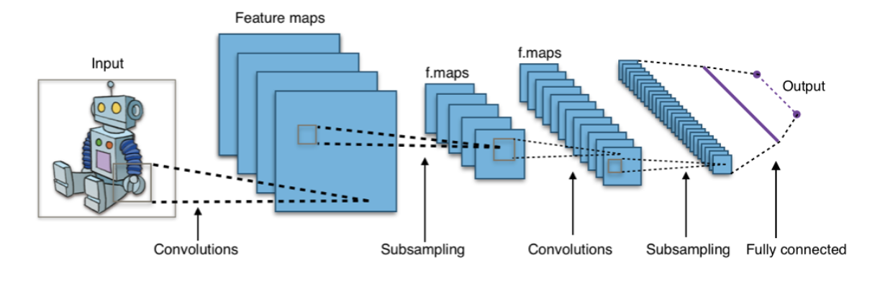
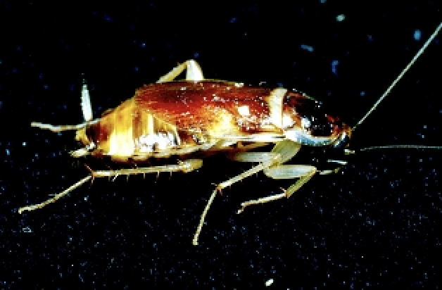
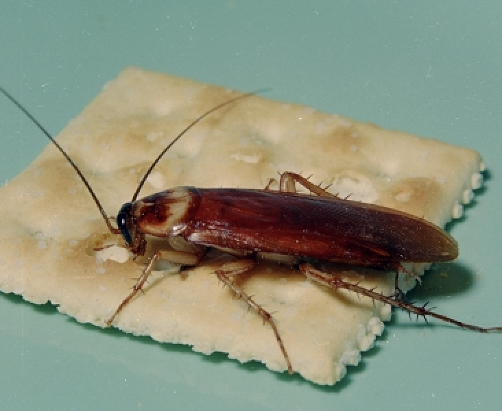

Title: Use CNN to classify insect images
Date: 2020-11-13 20:55
headline:Yiping's Blog 7

Classify  images using deep learning model

### Instruction:  
Train a deep learning model to classify beetles, cockroaches and dragonflies using these images. Note: Original images from https://www.insectimages.org/index.cfm. and explain how the neural network classified the images.

## Use Pytorch to build a CNN model to classify images

PyTorch is gaining popularity in the Deep Learning community and is widely being used by deep learning practitioners, PyTorch is a Python package that provides Tensor computations. Furthermore, tensors are multidimensional arrays just like NumPy’s ndarrays which can run on GPU as well.    
In deep learning, a convolutional neural network (CNN, or ConvNet) is a class of deep neural networks, most commonly applied to analyzing visual imagery.CNNs use relatively little pre-processing compared to other image classification algorithms. This means that the network learns the filters that in traditional algorithms were hand-engineered. This independence from prior knowledge and human effort in feature design is a major advantage.


### Loading Images

The easiest way to load image data is by using datasets.ImageFolder from torchvision.We need to define some transforms because images are of different sizes and shape and we need all image in training set to be of the same size for training.


```python
transform = transforms.Compose([transforms.Resize(255),
                                transforms.CenterCrop(224),
                                transforms.ToTensor()])
```


```python
train = datasets.ImageFolder("insects/train/", transform=transform)
test = datasets.ImageFolder("insects/test/", transform=transform)
```

Next, I have defined the train and test loader which will help us to load the training and test set in batches. I will define the batch size as 16:


```python
trainloader = torch.utils.data.DataLoader(train, batch_size=16, shuffle=True)
testloader = torch.utils.data.DataLoader(test, batch_size=16, shuffle=True)
```

Let’s look at the summary of the training set first:


```python
dataiter = iter(trainloader)
images, labels = dataiter.next()

print(images.shape)
print(labels.shape)
```

    torch.Size([16, 3, 224, 224])
    torch.Size([16])


When programming a CNN, the input is a tensor with shape (number of images) x (image height) x (image width) x (image depth). Then after passing through a convolutional layer, the image becomes abstracted to a feature map, with shape (number of images) x (feature map height) x (feature map width) x (feature map channels). A convolutional layer within a neural network should have the following attributes:

Convolutional kernels defined by a width and height (hyper-parameters).  
The number of input channels and output channels (hyper-parameter).  
The depth of the Convolution filter (the input channels) must be equal to the number channels (depth) of the input feature map.

So, in each batch, we have 16 images, each of size 224,224 and for each image, we have a corresponding label. Let’s visualize a training image and see how it looks:


```python
#get idea from stack overflow,view 
def imshow(image, ax=None, title=None, normalize=True):
  """Imshow for Tensor."""
  if ax is None:
      fig, ax = plt.subplots()
  image = image.numpy().transpose((1, 2, 0))

  if normalize:
      mean = np.array([0.485, 0.456, 0.406])
      std = np.array([0.229, 0.224, 0.225])
      image = std * image + mean
      image = np.clip(image, 0, 1)

  ax.imshow(image)
  ax.spines['top'].set_visible(False)
  ax.spines['right'].set_visible(False)
  ax.spines['left'].set_visible(False)
  ax.spines['bottom'].set_visible(False)
  ax.tick_params(axis='both', length=0)
  ax.set_xticklabels('')
  ax.set_yticklabels('')

  return ax
```


```python
imshow(images[3])
imshow(images[2])
```




### Defining Model

we'll use the following CNN as our classifier: 3 * 3 convolution -> 2 * 2 max pool -> 3 * 3 convolution -> 2 * 2 max pool -> fully connected to  R^256  -> fully connected to  R^224 -> fully connected to R^3 (prediction). 


```python
class CNN(nn.Module):
    def __init__(self):
        super().__init__()
        self.conv1 = nn.Conv2d(3, 32, kernel_size=3, padding=1)
        self.conv2 = nn.Conv2d(32, 64, kernel_size=3, padding=1)
        self.fc1 = nn.Linear(64*56*56, 256)
        self.fc2 = nn.Linear(256, 224)
        self.fc3 = nn.Linear(224, 3)

    def forward(self, x):
        # conv layer 1
        x = self.conv1(x)
        x = F.relu(x)
        x = F.max_pool2d(x, kernel_size=2)
        # conv layer 2
        x = self.conv2(x)
        x = F.relu(x)
        x = F.max_pool2d(x, kernel_size=2)
    
        
        # fc layer 1
        x = x.view(x.size(0) ,-1)
        x = self.fc1(x)
        x = F.relu(x)
        x = F.relu(self.fc2(x))
        # fc layer 2
        x = self.fc3(x)
        return x     
```

Let’s also define the optimizer and loss function then we will look at the summary of this model:


```python
model = CNN()
criterion = nn.CrossEntropyLoss()
optimizer = torch.optim.Adam(model.parameters(), lr=0.001)
if torch.cuda.is_available():
    model = model.cuda()
    criterion = criterion.cuda()
    
print(model)
```

    CNN(
      (conv1): Conv2d(3, 32, kernel_size=(3, 3), stride=(1, 1), padding=(1, 1))
      (conv2): Conv2d(32, 64, kernel_size=(3, 3), stride=(1, 1), padding=(1, 1))
      (fc1): Linear(in_features=200704, out_features=256, bias=True)
      (fc2): Linear(in_features=256, out_features=224, bias=True)
      (fc3): Linear(in_features=224, out_features=3, bias=True)
    )


So, we have 2 convolutional layers that will help to extract features from the images. Features from these convolutional layers are passed to the fully connected layer which classifies the images into their respective class. Now our model architecture is ready, let’s train this model for 10 epochs:


```python
for i in range(10):
    running_loss = 0
    for images, labels in trainloader:

        if torch.cuda.is_available():
          images = images.cuda()
          labels = labels.cuda()

        # Training pass
        optimizer.zero_grad()
        
        output = model(images)
        loss = criterion(output, labels)
        
        #This is where the model learns by backpropagating
        loss.backward()
        
        #And optimizes its weights here
        optimizer.step()
        
        running_loss += loss.item()
    else:
        print("Epoch {} - Training loss: {}".format(i+1, running_loss/len(trainloader)))
```

    Epoch 1 - Training loss: 0.3574588835472241
    Epoch 2 - Training loss: 0.29317969357362017
    Epoch 3 - Training loss: 0.25629913015291095
    Epoch 4 - Training loss: 0.2536721211508848
    Epoch 5 - Training loss: 0.24191003205487505
    Epoch 6 - Training loss: 0.1217296562390402
    Epoch 7 - Training loss: 0.06377113621965691
    Epoch 8 - Training loss: 0.0932836413885525
    Epoch 9 - Training loss: 0.03534464304766516
    Epoch 10 - Training loss: 0.1113793770095981


You can see that the training is decreasing with an increasing number of epochs. This means that our model is learning patterns from the training set. Let’s check the performance of this model on the test set:

### Test


```python
correct = 0
total = len(test)

with torch.no_grad():
    for images, labels in tqdm(testloader):
        x = images 
        y = model(x)

        predictions = torch.argmax(y, dim=1)
        correct += torch.sum((predictions == labels).float())

print('Test accuracy: {}'.format(correct/total))
```


    HBox(children=(FloatProgress(value=0.0, max=12.0), HTML(value='')))


    
    Test accuracy: 0.894444465637207


So, the model is around 89% accurate in predicting the labels for test images which is not bad and maybe it would better if we increase the epoches more, finish classifing the insects images using CNN. 


Reference : 
1. https://www.analyticsvidhya.com/blog/2020/07/how-to-train-an-image-classification-model-in-pytorch-and-tensorflow/    

2.https://medium.com/secure-and-private-ai-writing-challenge/loading-image-using-pytorch-c2e2dcce6ef2
