Title: Final Project: Interactive Dashboard and Modeling for Covid19
Date: 2020-11-20 20:55
headline:Yiping's Blog 8

## Overview  

### Our work can be seen from  [github](https://github.com/ys279/BIOSTAT823-Final-Project) and Streamlit [Dashboard](https://final-covid19-dashboard.herokuapp.com/)

Main objectives:  

Covid-19 interactive visualization that helps users to understand the information of COVID-19 spread across the world and US, and the current pandemic situation we are facing.    

Use different machine learning methods to predict confirm cases/death/confirmed cases in a next given period. For this project, we have tried three Model Prediction: SARIMAX model, SVR model, and prophet model. 

## Data Source   
Data Collection and processing
For our project, the main data source we use is JHU CSSE Covid-19 repository: https://github.com/CSSEGISandData/COVID-19  
We acquire all data through url and cleaned the data.   
More details are in the folder [data](https://github.com/ys279/BIOSTAT823-Final-Project/tree/master/data)  

## Interactive Dashboard  
 
Three are three part for data visualization : Map ,General Trend and Covid in US.  

#### Map  
* Daily updated active cases map worldwide  
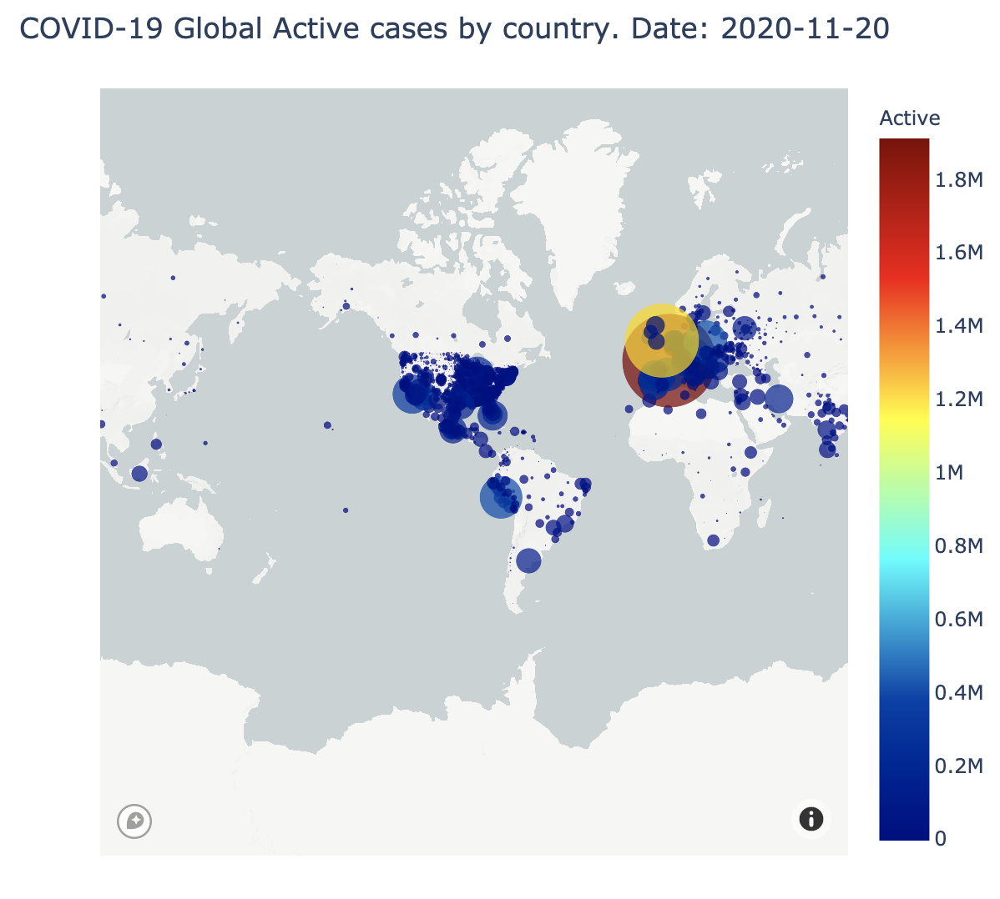

*Daily updated active /death cases map the US 

we specific US death and active cases among each state is US map section.  

[plotly] /images/us.json [/plotly] 
[plotly] /images/death.json [/plotly]

*Case-Fatality ratio map worldwide     
Case fatality ratio, that estimates this proportion of deaths among identified confirmed cases. As covid-19 is an ongoing pandemic, we decide to follow WHO guidelines to mitigate the bias due to delays during an ongoing outbreak. We calculate it by number of death/(number of death+number of recovered). Also, different to what we have in the global confirmed cases, where we show the data specified to each county, for this part we only specified it to each state, as the county data may be too small to show.  

[plotly] /images/case-fatality.json [/plotly] 

* Global spread of covid-19 maps, in which users can select their intrested time range and see the animated spread of COVID-19 across the world.   
we merge confirmed, death, and recovered data into one dataframe, then perform data cleaning due to missing values, wrong datatypes, and cases from cruise ships. Then we plot an animated covid-19 spread map for visualizing the change of confirmed cases overtime. We also put death and recover data on the hover text box, so they can check all three key information all at once. We allow users to choose their preferred date range to check how covid-19 is spread.We think this map is quite intuitive and educating, to illustrate the timeline of how we get from a normal life to now.

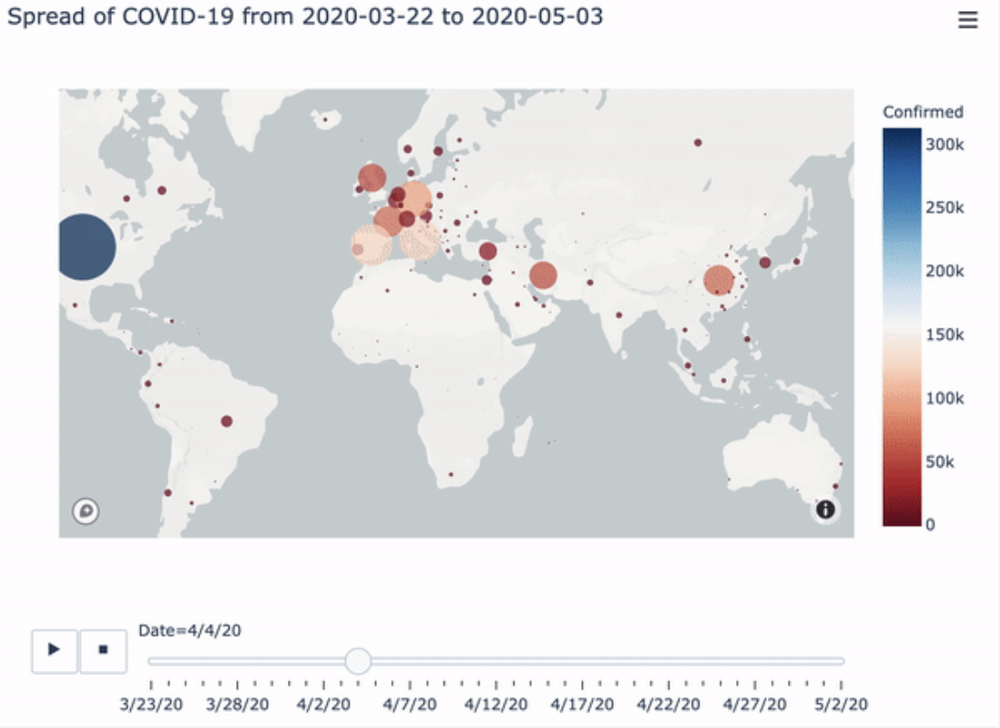

#### General Trend  
For this part, we visualize the country statistic into a more straight way, we selected countries that have highest max infection rate and you can see the cases or rate in each countries.  

* plot of top 10 highest max infection cases/rate countries
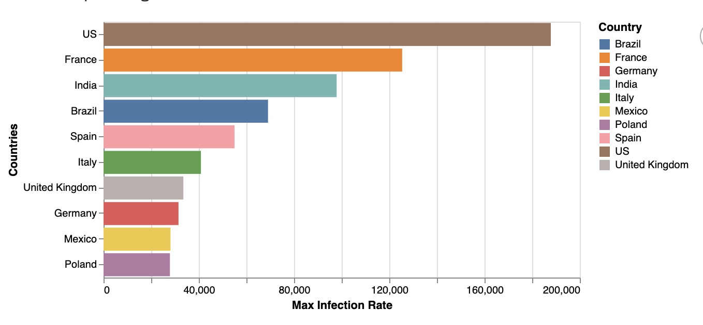

* General death,recover and confirmed cases trend for Covid19
You can choose any country you want to see in dashboard
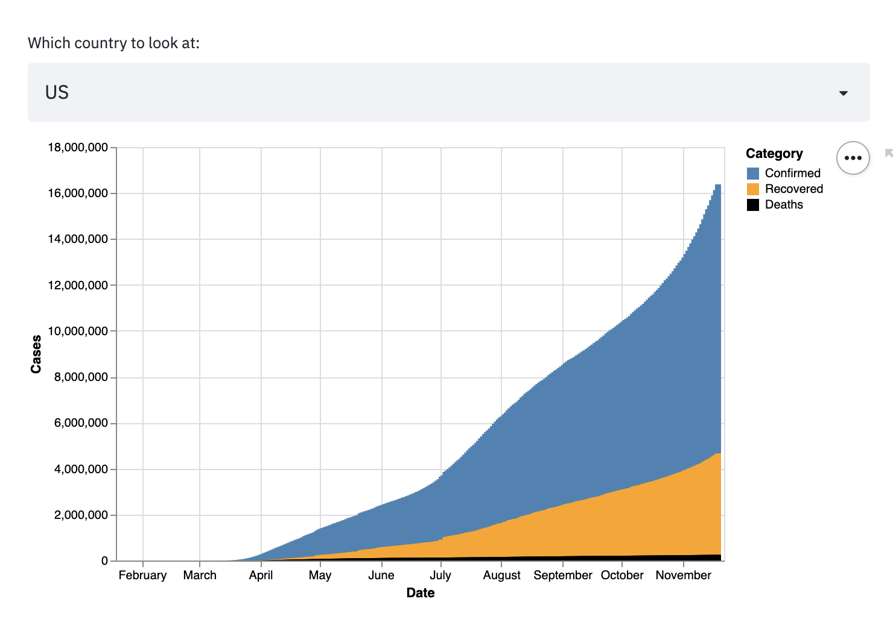

* General cases or Incident/infection Rate among countries 
You can choose any country you want to see in dashboard
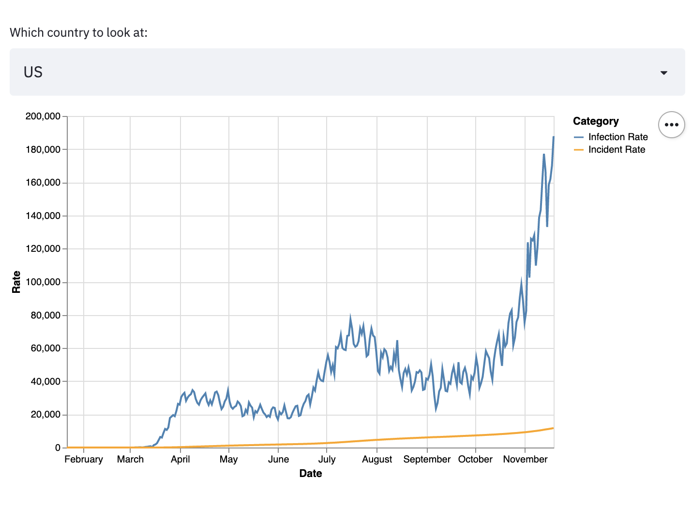

And from above plots, we can see  that US has the most severe cases worldwid. So next part will foucus on visualization covid in US. Death and survive rates help us understand the severity of Covid19, identify at-risk populations, and evaluate quality of healthcare in US.   

#### Covid19 in US 
* plot of death rates vs. survive rates in US 
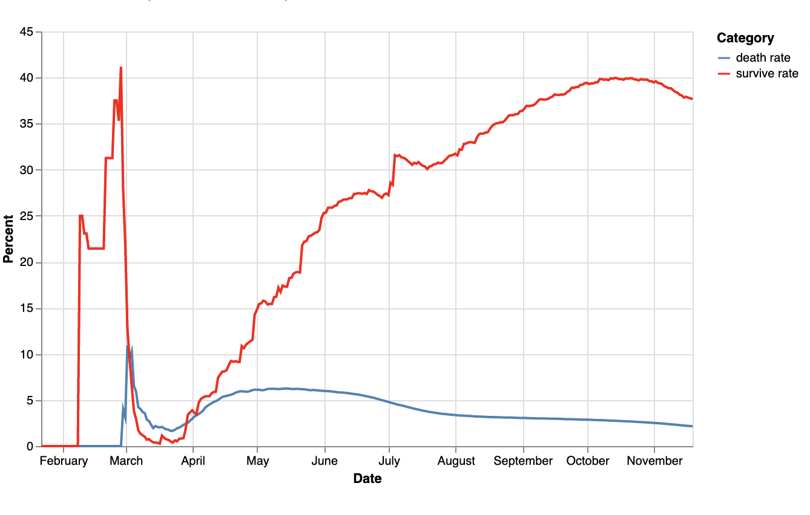  
Note that the Death Rate has stabilized to a fixed rate but it is above zero a lot. We still need to take more actions to reduce mortality. Survive Rate is increasing recently which is a good trend.   

* plot for confirm cases, death cases, and recover cases in US  
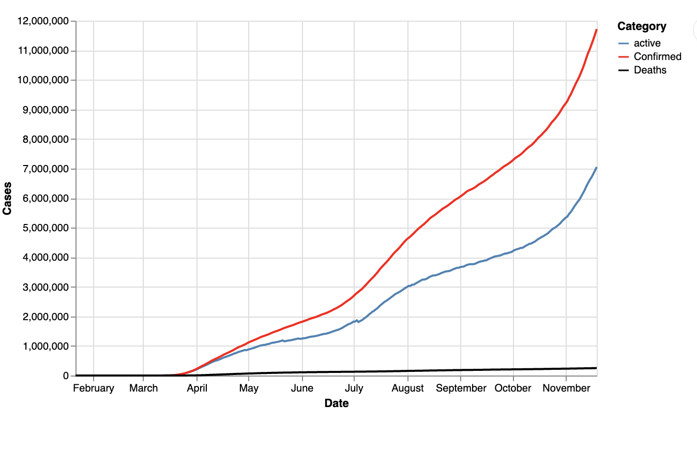  
We can see that the confirmed cases is extremly high which need us to make more attention to this.Though the death cases is not very high, the active cases is still a lot which means we need more health care for this.

## Model Development  
We have tried three time-series model to predict the number of new cases in a next given period.   
Models included:  
[SARIMAX](https://github.com/ys279/BIOSTAT823-Final-Project/blob/master/model/SARIMAX%2BProphet.ipynb)  

[SVR](https://github.com/ys279/BIOSTAT823-Final-Project/blob/master/model/SVR%20Model.ipynb)  

[Prophet](https://github.com/ys279/BIOSTAT823-Final-Project/blob/master/prophet_model.ipynb)  

### SARIMAX  

There are two reasons that we think SARIMAX could be appropriate for the modeling. Frist, due to the property of dataset itself, which is scraped from JHU's repository and only contains date time and the value of dependent variables(confirmed/death cases), using time series models seems to be a reasonable choices. Second, in terms of the global death number, the dataset we are using to build a time series model is actually the daily increase data. This daily increase data is not consistent, but appear periodically, according to one trace plot. Thus, addding seasonality to our model is plausible. In the meantime, the first 3 of these 4 orders of SARIMAX are just seasonal versions of the ARIMA orders, which means we need to find a seasonal autoregressive order denoted by upper-case P, an order of seasonal integration denoted by upper-case D, and a seasonal moving average order signified by upper-case Q. Therefore, after multiple analysis work, we think SARIMAX(5,2,4)(0,0,0)[0] is the most appropriate model for predicting the global COVID-19 death case with MAE being 2347.05.  

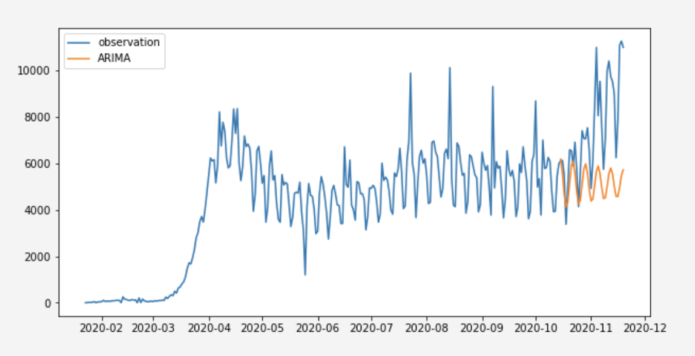  

### SVR  

We also implementing SVM classification method to predict covid worldwide as a whole . We apply this method to capture the predictor non-linearity and to improve the forecasting cases. In our case, we adopted polynomial kernel and use date as variables. we can see from the plot svm model is a good prediction model for predict all three kind of cases   
From above plot, we can see SVR is a good model in predicting confirmed and recovered cases ,yet not so accurate on predicting death cases.   

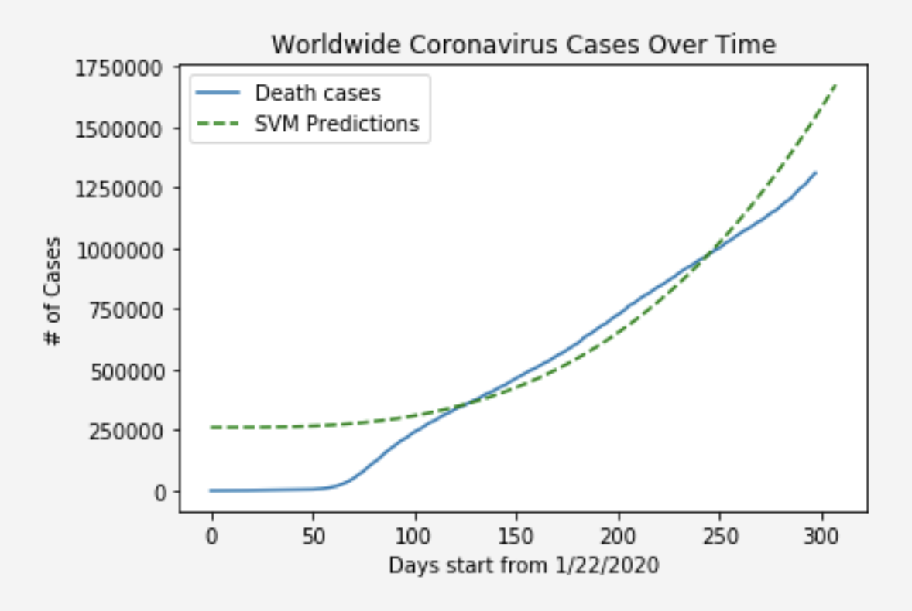
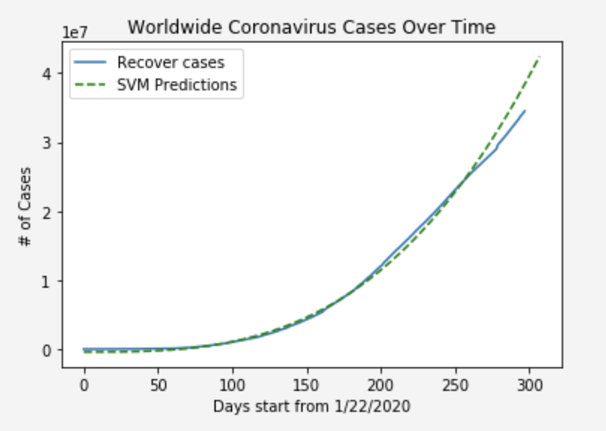
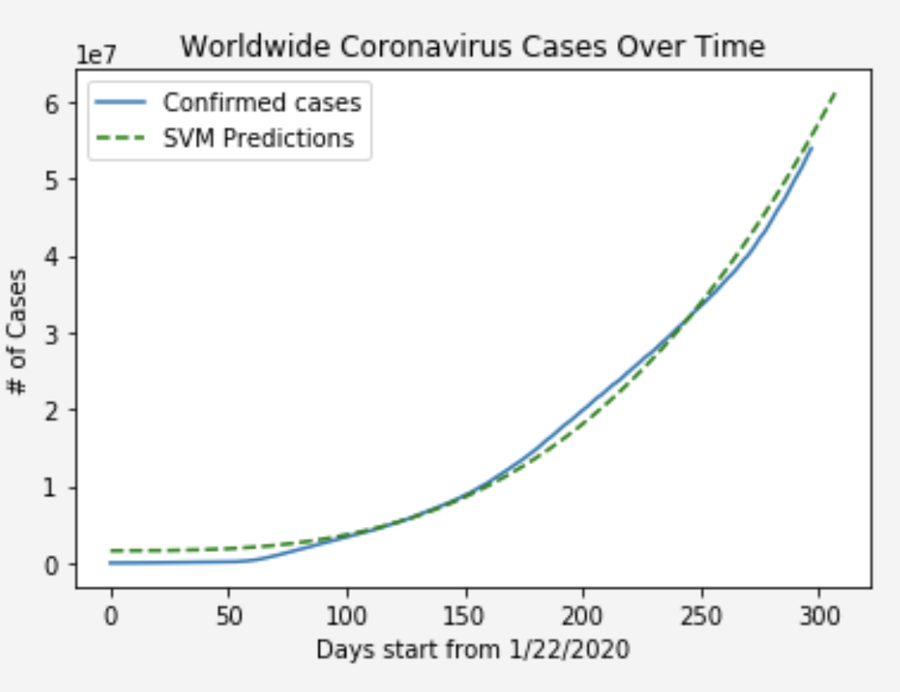

### Prophet
As for Prophet, an open source library that is published by Facebook, it has the ability to make good predictions for time series dataset, but works like a black box. The code and command are easy to use and the results are also pretty good. When using Prophet to predict the global death case, the MAE can be 1755.8, much less than using SARIMAX.  
We have trained prophet model use either logistic or linear functions as trend model. After evaluating the prediction result, we found this model performs well for short-term prediction. But for long-term, the results are out of our expectation. Below is the result plot.  

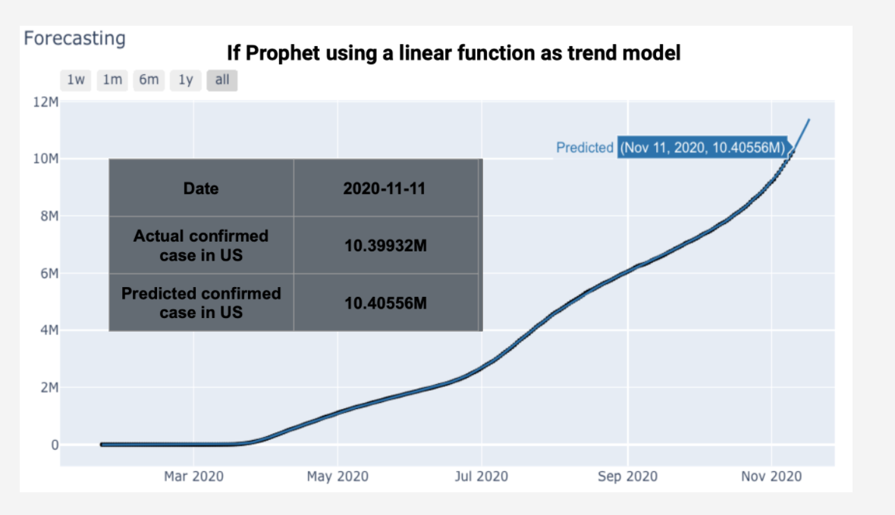
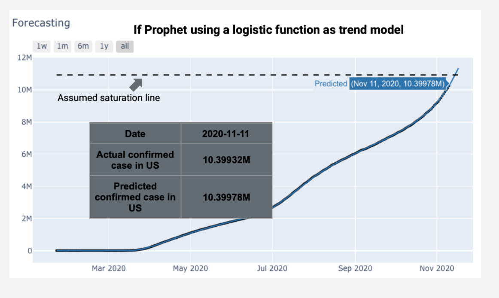

Each model has its advantage in prediction accuracy, but also has some limitations shown above. 

## Related Skills  
* Time series models  
* Functional programming  
* Data collection and preprocessing  
* Visualization with interactive plots (`plotly`, `altair`)  
* `streamlit` Dashboard   

## Reflection and Insight 
From what we analysis, we can see Covid19 is still severe worldwide, hope what we did can make more people to pay attention to it and hope more healthcare can be provided for this.

In this project, I have practiced my skills on collecting and cleaning datasets, visualizing data in dashboard, and exploring  time-series models and machine learning model for predicting new cases in the next time period. Also, I  practice my teamworking skills, especially we can only meet visually.

At last, thanks for all the work and amazing ideas from  my teammate : Xiangwen Mo, Fan Yang and Bingruo Wu. We had a great time working together and I also learned a lot from them. Also, it was a great experience studying BIOS823.  

## References  
https://github.com/CSSEGISandData/COVID-19  
https://plotly.com/python/scattermapbox/  
https://www.statsmodels.org/dev/examples/notebooks/generated/statespace_sarimax_stata.html  
https://www.sciencedirect.com/science/article/pii/S0960077920302538  
https://www.ncbi.nlm.nih.gov/pmc/articles/PMC7390340/  
https://machinelearningmastery.com/time-series-forecasting-with-prophet-in-python/  
https://www.streamlit.io/  
